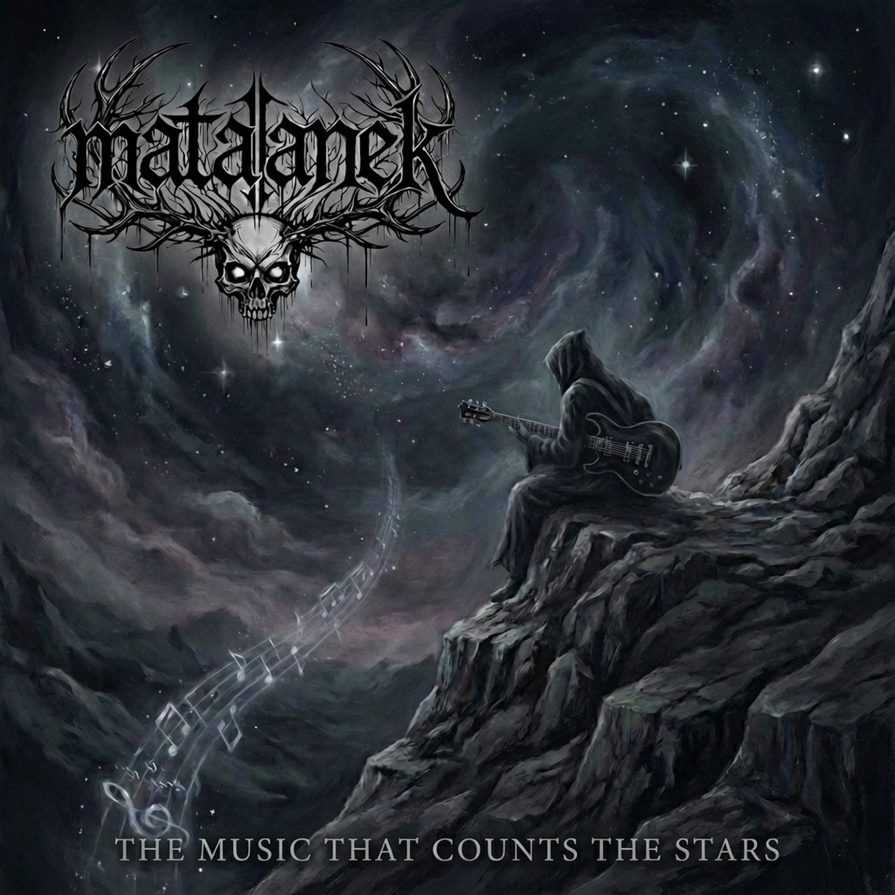

---
created: '2026-04-25'
sources:
- raw/Music.that.counts.the.stars.txt
tags:
- album
- music
- mataanek
title: The Music That Counts the Stars
type: entity
updated: '2026-04-25'
---

# The Music That Counts the Stars

The second EP by Mataanek, released February 1, 2026. Progressive doom metal unfolding me/us/cosmos. From disciplined fatigue through freedom's excuses to starry voids, evoking existential scale, primordial unknowns, and the faint music seeking listeners in the dark.

## EP Overview

*   **Release Date:** February 1, 2026
*   **Genre:** Progressive Doom Metal EP
*   **Concept:** From disciplined fatigue through freedom's excuses to starry voids

## Tracks

*   01 The Weight That Wakes Me
*   02 The Society Fracture
*   03 The Music That Counts the Stars
*   04 The Music That Counts the Stars - Alternate Edit

## 🎶 Lyrics (Full)

### 💔 01 - The Weight That Wakes Me

**Description:** Doom metal steeped in personal gloom, fatigue, and existential heaviness.

**Lyrics:**

[Verse 1]
I wake beneath a weight so great
It presses down upon my chest
Each breath a struggle, each minute long
As if I carry all the world's wrong

[Chorus]
The weight that wakes me, strong and cold
A story left beyond untold
It strips away each pretense's hold
Leaving only what I've always known

[Verse 2]
Not sadness, not despair, but sheer
The weight of being truly here
In every cell, in every breath
The confrontation with my death

[Bridge]
And yet within this pressure's grasp
A clarity begins to clasp
To see what matters, what is true
When all the façades fall through

[Outro]
I rise not lightened, not unburdened
But changed by what I've witnessed
The weight remains, yet I am more
Than what it sought to hold before

### 💥 02 - The Society Fracture

**Description:** A track exploring the breakdown of social constructs and the search for authenticity.

**Lyrics:**

[Verse 1]
They sold me dreams in neat despair
Packaged as hope beyond compare
Buy this, be that, conform, obey
And all your pain will fade away

[Chorus]
The society fracture, spreading wide
Where promised cures have failed and died
I see the seams where hope was sewn
Now coming loose, now torn asunder

[Verse 2]
The remedies they offer now
Are just the same poisons, somehow
Repackaged, renamed, resold
As if the first time wasn't told

[Bridge]
I don't want your false salvation
Your curated revelation
I want to see what's really there
Behind the curtain, beyond the snare

[Outro]
I walk away from what they're selling
Not toward some new rebellion
But simply to exist, to be
Without the weight of what they see

### 🌟 03 - The Music That Counts the Stars

**Description:** The title track, evoking existential scale and the faint music seeking listeners in the dark.

**Lyrics:**

[Verse 1]
From disciplined fatigue I start
Through freedom's excuses, playing part
Not lazy, not indulgent, but weary
Of playing roles that leave me dreary

[Chorus]
The music that counts the stars so faint
Is not for ears that scream and faint
It's for the few who've learned to hear
The quiet sounds that thrive right here

[Verse 2]
In primordial unknowns I dwell
Where time and space begin to tell
A different tale than what we've known
Of interconnected, not alone

[Bridge]
I do not seek to be understood
Nor do I ask for applause, that's good
I only ask that you might hear
What plays when all the rest is clear

[Outro]
I listen close, I strain my ear
For music not of scream or fear
But of the quiet, deep, and true
That plays the whole night through

### 🌟 04 - The Music That Counts the Stars - Alternate Edit

**Description:** An alternate mix/edit of the title track, offering a different perspective on the same themes.

**Lyrics:**

[Same as track 3 but with different arrangement/focus]

[Verse 1]
From disciplined fatigue I start
Through freedom's excuses, playing part
Not lazy, not indulgent, but weary
Of playing roles that leave me dreary

[Chorus]
The music that counts the stars so faint
Is not for ears that scream and faint
It's for the few who've learned to hear
The quiet sounds that thrive right here

[Verse 2]
In primordial unknowns I dwell
Where time and space begin to tell
A different tale than what we've known
Of interconnected, not alone

[Bridge]
I do not seek to be understood
Nor do I ask for applause, that's good
I only ask that you might hear
What plays when all the rest is clear

[Outro]
I listen close, I strain my ear
For music not of scream or fear
But of the quiet, deep, and true
That plays the whole night through

---
*This EP represents Mataanek's exploration of existential themes through progressive doom metal, moving from personal weight to cosmic perspective.*

## Related Entities

*   [[band/mataanek]]
*   [[band/the-weight-that-wakes-me]]

