# Skills Architecture Diagram

This file provides a visual representation of how our custom skills interact with the Hermes agent core and external services.

## Mermaid Diagram: Custom Skills Interaction Flow

```mermaid
flowchart TD
    %% Core Components
    A[Hermes Agent Core] --> B[Custom Skills Layer]
    A --> C[Built-in Tools: web_search, terminal, etc.]
    A --> D[Local LLM Engine: localhost:8080]
    
    %% Custom Skills Categories
    B --> E[Home Automation & IoT]
    B --> F[Health & Personal Analytics]
    B --> G[Communication & Media]
    B --> H[Productivity & Knowledge Management]
    B --> I[Software Development & Engineering]
    B --> J[MLOps & AI/ML]
    B --> K[Financial Analysis & Trading]
    B --> L[Miscellaneous Utilities]
    
    %% Home Automation & IoT
    E --> E1[openrgb-control: RGB lighting]
    E --> E2[voice-control: STT/TTS & wake word]
    E --> E3[netatmo-control: weather data]
    E --> E4[hue-control/openhue: Philips Hue]
    E --> E5[smart-home: framework]
    
    %% Health & Personal Analytics
    F --> F1[health-data-wiki-update: Apple Health → wiki]
    F --> F2[health-data-extraction: detailed workout data]
    F --> F3[garmin-connect: Garmin sync]
    
    %% Communication & Media
    G --> G1[freshrss-news-*: news digest generation]
    G --> G2[himalaya: email client]
    G --> G3[xitter/xurl: Twitter/X interaction]
    G --> G4[spotify: music control]
    G --> G5[youtube-content: video processing]
    
    %% Productivity & Knowledge Management
    H --> H1[notion: API integration]
    H --> H2[obsidian: vault read/write]
    H --> H3[airtable: REST API]
    H --> H4[linear: issue/project management]
    H --> H5[maps: geocoding/routing]
    H --> H6[nano-pdf/powerpoint: document editing]
    H --> H7[teams-meeting-pipeline: Teams automation]
    H --> H8[band-wiki-update: discography maintenance]
    H --> H9[Whiskey Wiki Update: whiskey catalog]
    H --> H10[google-workspace: Gmail/Drive/etc.]
    H --> H11[quick-note: timestamped notes]
    
    %% Software Development & Engineering
    I --> I1[hermes-agent-skill-authoring: SKILL.md creation]
    I --> I2[code-review: PR analysis]
    I --> I3[debugging-hermes-tui-commands: TUI debugging]
    I --> I4[requesting-code-review: pre-commit checks]
    I --> I5[subagent-driven-development: delegate_task workflows]
    I --> I6[systematic-debugging: root cause analysis]
    I --> I7[test-driven-development: TDD enforcement]
    I --> I8[writing-plans: implementation planning]
    I --> I9[agent-soul-md-update: agent profile updates]
    
    %% MLOps & AI/ML
    J --> J1[hermes-neutts-voice: custom voice cloning]
    
    %% Financial Analysis & Trading
    K --> K1[vibe-trading: backtesting, factor analysis, etc.]
    K --> K2[mcp_vibe_trading_*: 71 finance skills]
    
    %% Miscellaneous Utilities
    L --> L1[rule-0-verification-protocol: fact-checking]
    L --> L2[yuanbao: group/user management]
    L --> L3[dogfood: web app QA]
    L --> L4[czech-corrector: text correction]
    
    %% External Service Connections
    E1 --> Z1[(OpenRGB Daemon)]
    E2 --> Z2[(Local Whisper/NeuTTS)]
    E3 --> Z3[(Netatmo Devices)]
    E4 --> Z4[(Philips Hue Bridge)]
    F1 --> Z5[(Apple Health Export)]
    F2 --> Z5
    F3 --> Z6[(Garmin Connect API)]
    G2 --> Z7[(Email IMAP/SMTP)]
    G3 --> Z8[(X/Twitter API)]
    G4 --> Z9[(Spotify API)]
    G5 --> Z10[(YouTube)]
    H1 --> Z11[(Notion API)]
    H2 --> Z12[(Obsidian Vault)]
    H3 --> Z13[(Airtable API)]
    H4 --> Z14[(Linear API)]
    H5 --> Z15[(OpenStreetMap/OSRM)]
    H6 --> Z16[(Local File System)]
    H7 --> Z17[(Microsoft Graph)]
    H8 --> Z18[(mataanek.eu/raw files)]
    H9 --> Z19[(Whisky Data Sources)]
    H10 --> Z20[(Google Workspace APIs)]
    J1 --> Z21[(Local Audio System)]
    K1 --> Z22[(Financial Data Sources)]
    L1 --> Z23[(Internal Knowledge)]
    L2 --> Z24[(Group Metadata)]
    L3 --> Z25[(Web Applications)]
    L4 --> Z26[(LanguageTool)]
    
    %% Styling
    classDef core fill:#1f2937,stroke:#ef4444,color:white;
    classDef skills fill:#374151,stroke:#10b981,color:white;
    classDef external fill:#4b5563,stroke:#6366f1,color:white;
    classDef llm fill:#6366f1,stroke:#f59e0b,color:white;
    
    class A core
    class B,I,J,K,L skills
    class D llm
    class Z1,Z2,Z3,Z4,Z5,Z6,Z7,Z8,Z9,Z10,Z11,Z12,Z13,Z14,Z15,Z16,Z17,Z18,Z19,Z20,Z21,Z22,Z23,Z24,Z25,Z26 external
```

## Key Interaction Patterns

### 1. **Skill → External API**
Most communication skills (email, Twitter, Spotify, Notion, etc.) follow this pattern:
- Skill formats request using external API documentation
- Skill makes HTTP call via terminal tool or direct library (if available)
- Skill processes response and returns structured data
- Output often written to wiki or shared with user

### 2. **Skill → Local Service**
Home automation and media skills interact with local daemons:
- `openrgb-control` → OpenRGB daemon via CLI
- `voice-control` → Whisper (STT) + NeuTTS (TTS) pipelines
- `netatmo-control` → Netatmo API (via local cache or direct)
- `hue-control` → Hue Bridge local API

### 3. **Skill → LLM Engine**
Skills requiring generative AI:
- `freshrss-news-*` sends prompts to `localhost:8080` for summarization
- `hermes-neutts-voice` uses LLM for text processing before voice synthesis
- Code generation skills may query LLM for snippets

### 4. **Skill → Wiki/File System**
Knowledge management and analytics skills:
- `health-data-wiki-update` appends to `wiki/health-data.md`
- `band-wiki-update` modifies markdown files in `wiki/band/`
- `quick-note` creates timestamped files in notes directory
- Most skills log outcomes to personal log or skill-specific wiki pages

### 5. **Orchestration Patterns**
- **Sequential**: News fetch → summarization → wiki storage → notification
- **Parallel**: Multiple health data sources processed concurrently
- **Feedback Loop**: Voice command → skill execution → TTS response → user confirmation

## Technology Stack References

### Communication Protocols
- **HTTP/REST**: Most external APIs (Notion, Airtable, Linear, Google Workspace, etc.)
- **WebSocket**: Voice control real-time audio streams
- **CLI/Daemon**: OpenRGB, Hue (via local network), Netatmo
- **Database**: Airtable (REST), Linear (GraphQL), Notion (REST)

### Data Formats
- **JSON**: Primary format for API requests/responses
- **Markdown**: Wiki storage format
- **CSV/Excel**: Health data exports (Apple Health, Garmin)
- **Audio**: PCM/WAV for voice processing
- **Image**: PNG/JPG for ComfyUI interactions (via skills)

## Next Steps for Diagram Enhancement
- Add sequence diagrams for common workflows (e.g., "process morning health data")
- Include error handling and retry patterns in skill interactions
- Map specific MCP server integrations (vibe-trading-mcp, etc.)
- Show data flow for skill chaining (e.g., news digest → TTS → voice output)

---\
*Visual representation of custom skills architecture for Hermes agent environment.*